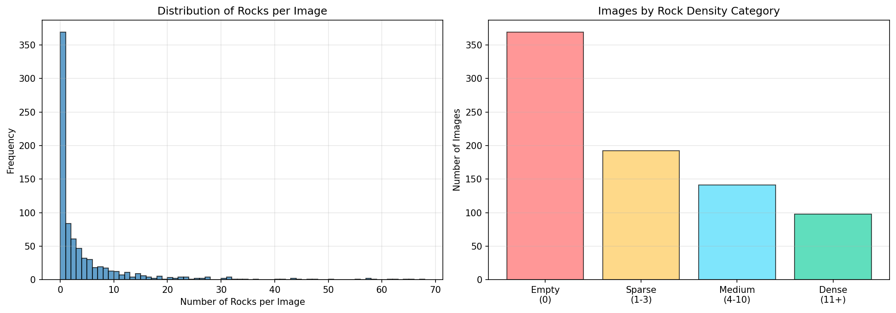

# Rock Detection Model Improvements

This document tracks all improvements made to the baseline rock detection models to reduce false positives and improve performance for nationwide deployment.

---

## 📊 Baseline Performance 

### Objective
Re-evaluate Alexis's trained models on the test set to establish a reproducible baseline before implementing improvements.

### Models Tested
- `baseline_best.pt` - Best supervised model from Alexis's work
- `active_teacher.pt` - Semi-supervised model with Active Teacher framework

### Dataset
- **Test set:** 96 images, 367 labeled rocks
- **Source:** Swisstopo ground truth (Valais + Grisons regions)
- **Resolution:** 0.5m/pixel, 640×640 patches
- **Input:** RGB + hillshade fusion (green channel replacement)

### Evaluation Settings
- Confidence threshold: 0.10
- IoU threshold: 0.4
- Device: NVIDIA RTX 2080 Ti

### Results

| Model | Metric | Alexis (Report) | Our Results | Difference |
|-------|--------|----------------|-------------|------------|
| **baseline_best** | Precision | 71.0% | 75.4% | +4.4% ✅ |
| | Recall | 72.8% | 76.0% | +3.2% ✅ |
| | F1 | 71.9% | 75.7% | +3.8% ✅ |
| | F2 | 72.5% | 75.9% | +3.4% ✅ |
| | mAP50 | 77.2% | 79.2% | +2.0% ✅ |
| | mAP50-95 | 42.5% | 44.9% | +2.4% ✅ |
| **active_teacher** | Precision | 57.6% | 72.8% | +15.2% ⚠️ |
| | Recall | 84.2% | 75.7% | -8.5% ⚠️ |
| | F1 | 68.5% | 74.2% | +5.7% |
| | F2 | 77.1% | 75.1% | -2.0% ✅ |
| | mAP50 | 77.4% | 77.4% | 0.0% ✅ |
| | mAP50-95 | 43.9% | 43.7% | -0.2% ✅ |

**Conclusion:** Baseline models successfully reproduced. Both models perform well (~75-79% mAP50) but suffer from false positives as noted by Swisstopo feedback.

---

## Step 1: Cross-Patch Duplicate Suppression

### Problem
When 1km tiles are split into overlapping 640×640 patches (210px overlap), rocks in overlap regions are detected multiple times, inflating false positive counts.

### Method
Developed label-based duplicate detection that converts patch-local YOLO coordinates to tile-global coordinates using patch position and stride calculation.

**Algorithm:**
```python
# Convert patch-local normalized coords to tile-global pixels
stride = patch_size - overlap  # 640 - 210 = 430px
global_x = (cx * 640) + (col * stride)
global_y = (cy * 640) + (row * stride)

# Boxes are duplicates if distance < threshold
distance = sqrt((x1 - x2)² + (y1 - y2)²)
is_duplicate = distance < 15 pixels  # ~7.5m at 0.5m resolution
```

### Results
- **Test set analysis:** 96 patches from 6 unique tiles
- **Duplicates found:** 8 duplicate rocks across 6 patch pairs
- **Average distance:** 2.5 pixels between duplicate detections
- **Detection rate:** ~10% of test set images contain duplicates


### Impact on Metrics
Duplicate suppression will be applied during **post-processing** on nationwide inference to reduce false positives without retraining models.

### Implementation
- Scripts: `scripts/analysis/duplicate_suppression/`
- See `scripts/analysis/duplicate_suppression/README.md` for usage

---
## Step 2: Strategic Data Augmentation 

### Problem
Training set has balanced rock distribution: 46% empty/sparse images vs. 54% medium/dense. But model may struggle with challenging cases (sparse rocks, negative samples).



### Strategy
Apply **targeted augmentation** focusing on difficult samples to reduce false positives:
- **Empty** (0 rocks): 3x augmentation → Teach "not a rock"
- **Sparse** (1-3 rocks): 5x augmentation → Hard positives
- **Medium** (4-10 rocks): 2x augmentation → Balanced samples
- **Dense** (11+ rocks): No augmentation → Already sufficient examples


### Approaches Tested
**A) Baseline + YOLO augmentation:** Alexis' original model with standard YOLO augmentation

**B) Targeted augmentation + YOLO augmentation:** Pre-augmented dataset (~2,812 images) + YOLO's default augmentations


### Results

| Model | Precision | Recall | F1 | mAP50 | mAP50-95 |
|-------|-----------|--------|----|----|----------|
| **Baseline + YOLO aug** | 75.4% | 76.0% | 75.7% | 79.2% | 44.9% |
| **Targeted + YOLO aug** | 73.1% | 61.3% | 66.7% | 70.6% | 31.4% |
| **Change** | -2.3% ❌ | -14.7% ❌ | -9.0% ❌ | -8.6% ❌ | -13.5% ❌ |

### Analysis
- **Issue 1:** Double augmentation (pre-augmentation + YOLO augmentation) may have over-degraded images
- **Issue 2:** Aggressive augmentations (5x for sparse, 3x for empty) could have introduced too much noise
- **Issue 3:** Model may have overfit to augmented artifacts rather than learning rock features

### Next Iterations to Test
1. **Baseline without augmentation:** Evaluate if YOLO augmentation is actually helping or hurting
2. **Targeted augmentation only:** Pre-augmented dataset without additional YOLO augmentation during training
3. **Reduced augmentation intensity:** Lower augmentation factors (2x sparse, 1x empty) with gentler transforms
4. **Hard negative mining:** Add challenging false positive samples from non-rock regions (forests, urban, glaciers)

### Implementation
- Scripts: `scripts/analysis/data_augmentation/`
- See `scripts/analysis/data_augmentation/README.md` for usage

---

## 🗓️ Project Timeline & Next Steps

### **December 17, 2025**  In Progress
**Focus:** Improve augmentation strategy
- [ ] Re-evaluate baseline **without** YOLO augmentation
- [ ] Test targeted augmentation **without** additional YOLO augmentation
- [ ] Reduce augmentation intensity (gentler transforms, lower factors)
- [ ] Hard negative mining: Collect false positive samples from non-rock regions
  - Urban areas (Basel, Geneva)
  - Dense forests (Jura, Plateau)
  - Glaciers (Alps)
- [ ] Train with hard negatives integrated into dataset

### **December 19, 2025** Planned
**Focus:** Nationwide data preparation
- [ ] Run preprocessing pipeline on all remaining Swiss cantons
  - Bern, Vaud, Ticino, Zurich, etc.
- [ ] Verify tile processing (RGB + hillshade fusion)
- [ ] Quality check

### **December 23, 2025** Planned
**Focus:** Advanced training techniques
- [ ] Implement focal loss training
  - Target: Reduce false positives by penalizing easy negatives
  - Compare focal loss vs. standard cross-entropy
- [ ] Hyperparameter tuning for focal loss (alpha, gamma)
- [ ] Evaluate on test set and compare to baseline

### **December 26, 2025**  Planned
**Focus:** Alternative model architectures
- [ ] Explore non-YOLO detectors for single-object detection:
  - **RetinaNet:** Strong with focal loss, excellent for small objects
  - **Faster R-CNN:** Two-stage detector, higher precision, slower inference
  - **DETR (Detection Transformer):** End-to-end, no NMS needed
- [ ] Train selected architecture on rock detection

### **To Be Determined** 📅
**Early January remotely**, **January 12, 2026**, **January 13, 2026**, **January 14, 2026** 
- [ ] Final model selection based on precision/recall requirements
- [ ] Nationwide inference on all Swiss cantons
- [ ] Post-processing: Duplicate suppression at scale
- [ ] Shapefile generation and delivery to Swisstopo
---

## Success Metrics

Target improvements over baseline (mAP50: 79.2%, Precision: 75.4%):
- **Primary:** Precision > 80% (fewer false positives for Swisstopo)
- **Secondary:** Maintain recall > 70% (don't miss too many rocks)
- **Stretch:** mAP50 > 82% (overall detection quality)
